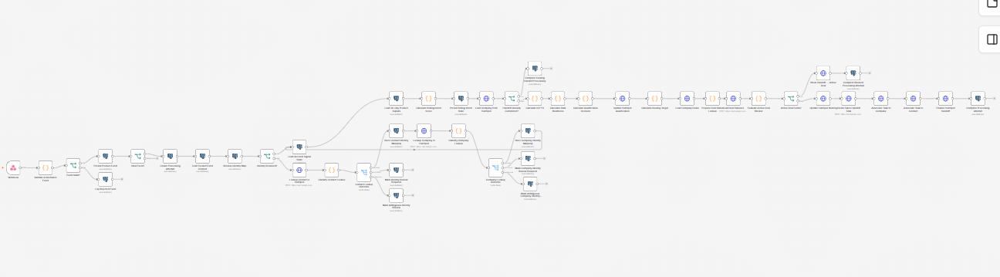
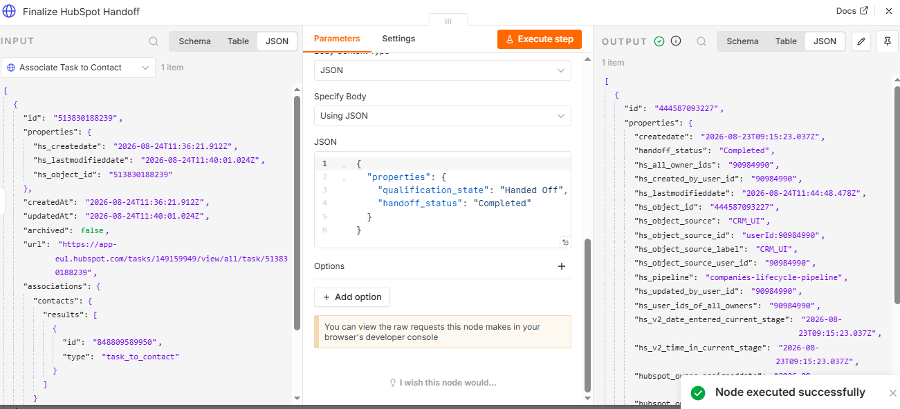
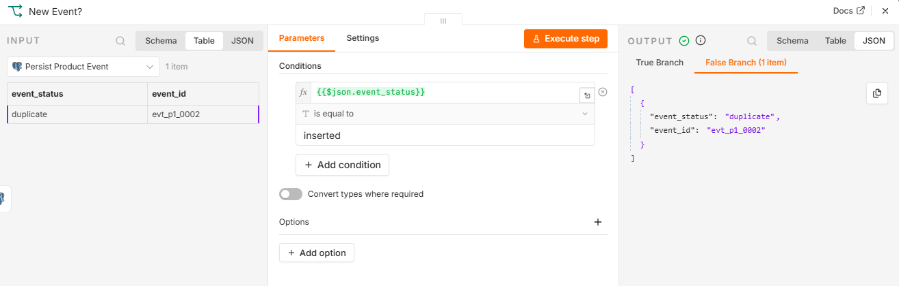
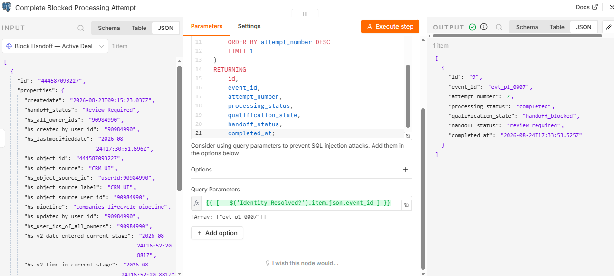

# P1 — End-to-End Product-Led Revenue Qualification & Sales Handoff System

An event-driven Revenue Systems implementation that converts product usage and signup signals into validated, identity-resolved, qualified, and auditable sales handoffs in HubSpot.

[](LICENSE)
[](https://github.com/mahdi-eqbal/p1-product-led-revenue-system/actions/workflows/repository-quality.yml)


> This is an independently designed and implemented professional case study using synthetic B2B SaaS data. It is not presented as a client engagement, employer deployment, production implementation, or claimed commercial revenue result.

## Quick Review

- [System architecture](architecture/system-architecture.md)
- [End-to-end data flow](architecture/data-flow-and-processing-sequence.md)
- [Logical data model](architecture/logical-data-model.md)
- [Source-of-truth matrix](architecture/source-of-truth-matrix.md)
- [Architecture decisions](adrs/)
- [Implementation documentation](docs/)
- [Importable n8n workflow](workflows/p1-product-led-revenue-qualification-sales-handoff.json)
- [Sample product events](sample-events/)
- [SQL assets](sql/)
- [Implementation evidence](evidence/)

## Business Problem

Product-led B2B SaaS teams generate valuable signup and usage signals, but those signals often remain disconnected from the revenue workflow. This creates several operational problems:

- fragmented product and CRM identities;
- inconsistent qualification decisions;
- duplicate or repeated sales handoffs;
- sales activity created for accounts with an active deal;
- missing company and routing context;
- limited visibility into failures and retries;
- no durable audit trail explaining why sales was—or was not—asked to act.

This system introduces a controlled orchestration and decision layer between product events and HubSpot sales execution.

## System Outcome

The implementation turns a raw product event into one of several explicit outcomes:

- qualified and handed off to sales;
- blocked because a handoff was already completed;
- suppressed because an active deal exists;
- rejected because the event is invalid or unauthenticated;
- routed to review because identity cannot be resolved safely;
- recorded as failed with sufficient context for controlled retry.

## Architecture

| Layer | Responsibility |
|---|---|
| Product system | Emits signup and product-usage events |
| n8n | Authenticates, validates, resolves identity, applies business rules, coordinates APIs, and controls handoff |
| PostgreSQL / Supabase | Stores product events, identity mappings, rolling intent state, processing attempts, and audit history |
| HubSpot | Maintains revenue lifecycle state and executes the sales-facing handoff |
| JavaScript | Implements deterministic validation, scoring, qualification, and routing logic |

### End-to-End Processing Flow

```text
Product Event
    ↓
Authentication & Validation
    ↓
Durable Event Persistence & Duplicate Detection
    ↓
Identity Resolution & Company Context
    ↓
Rolling Product Intent + ICP Fit + Data Readiness
    ↓
Qualification Decision
    ↓
Existing Handoff Guard + Active Deal Guard
    ↓
Routing + Sales Task + CRM Associations
    ↓
Handoff Completion + Audit State
```

### Implemented Workflow



## Core Capabilities

### Authenticated Event Ingress

- accepts structured product and signup events through an n8n webhook;
- validates the expected authentication header;
- rejects unauthenticated requests before business processing;
- normalizes and validates required event fields.

### Durable Event Processing

- persists accepted events before downstream processing;
- uses event identity to prevent duplicate execution;
- creates durable processing-attempt records;
- separates transient workflow execution from operational state.

### Identity Resolution

- resolves contacts using email and `product_user_id`;
- loads company context from HubSpot;
- persists identity mappings for later events;
- supports identity-cache hits and fallback lookup paths;
- routes unresolved or ambiguous identities to review instead of guessing.

### Qualification

Qualification is deterministic rather than AI-driven. The decision combines:

- rolling 30-day product intent;
- ICP fit;
- data readiness;
- contact and company context;
- explicit qualification reasons.

### Handoff Controls

Before creating sales activity, the system checks:

- whether a completed handoff already exists;
- whether the company already has an active deal;
- whether routing context is complete;
- whether the contact and company associations are valid.

Only an eligible record proceeds to task creation and final handoff state.

### Reliability and Auditability

- event-level idempotency;
- explicit duplicate-event handling;
- database constraints;
- persistent processing attempts;
- retry-safe handoff behavior;
- failure metadata and controlled recovery paths;
- operational audit state outside the CRM.

## Validated Scenarios

| Scenario | Expected system behavior |
|---|---|
| Authenticated valid event | Accepted, normalized, and persisted |
| Unauthenticated request | Rejected before business processing |
| Invalid event | Routed to the validation-rejection path |
| New qualified product signal | Qualified, routed, and handed off |
| Duplicate event | Detected without duplicate downstream processing |
| Existing completed handoff | Additional handoff blocked |
| Active deal | New sales handoff suppressed |
| Identity-cache hit | Contact resolved without unnecessary fallback lookup |
| Unresolved identity | Sent to review rather than matched unsafely |
| Retry after controlled failure | Completed without creating a duplicate handoff |

## Evidence Highlights

### Successful HubSpot Handoff



### Duplicate-Event Protection



### Active-Deal Guard



Additional evidence is organized by system boundary:

- [`evidence/n8n/`](evidence/n8n/) — workflow paths, decisions, guards, retries, and completion states;
- [`evidence/crm/`](evidence/crm/) — HubSpot lifecycle and handoff records;
- [`evidence/database/`](evidence/database/) — event, identity, qualification, and audit state;
- [`evidence/api/`](evidence/api/) — authenticated requests and integration behavior.

## Repository Structure

```text
p1-product-led-revenue-system/
├── adrs/          # Architecture decision records
├── architecture/  # Architecture, data flow, data model, and source-of-truth documentation
├── docs/          # Implementation and operational documentation
├── evidence/      # Executed workflow, CRM, database, and API evidence
├── sample-events/ # Synthetic product and signup payloads
├── scripts/       # Supporting implementation scripts
├── sql/           # PostgreSQL schema and queries
├── workflows/     # Redacted, importable n8n workflow export
├── .gitignore
└── README.md
```

## How to Review the Implementation

1. Start with the [system architecture](architecture/system-architecture.md) and [end-to-end data flow](architecture/data-flow-and-processing-sequence.md).
2. Review the [source-of-truth matrix](architecture/source-of-truth-matrix.md) to understand system ownership.
3. Inspect the database assets under [`sql/`](sql/).
4. Review the importable workflow under [`workflows/`](workflows/).
5. Use the synthetic payloads under [`sample-events/`](sample-events/) to understand ingress contracts.
6. Compare the positive, negative, duplicate, guard, and retry outcomes under [`evidence/`](evidence/).

## Security

Sensitive integration data is intentionally excluded from the repository. The public assets must not contain:

- HubSpot private-app tokens;
- database passwords or connection strings;
- webhook authentication secrets;
- API keys or session tokens;
- production credentials;
- unredacted personal or customer data.

The published workflow export is intended to preserve architecture and business logic without distributing active credentials.

## What This Project Demonstrates

- Revenue Systems architecture for a product-led motion;
- HubSpot lifecycle and handoff design;
- event-driven n8n orchestration;
- PostgreSQL-backed operational state;
- REST API and webhook integration;
- deterministic qualification and routing;
- CRM identity resolution and association handling;
- idempotency, negative-path controls, retry behavior, and auditability;
- evidence-based implementation validation.

---

Built by [Mahdi Eqbal](https://github.com/mahdi-eqbal) as an independent Revenue Systems / GTM Engineering implementation case study.


